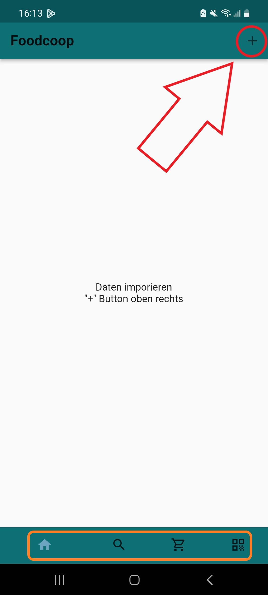
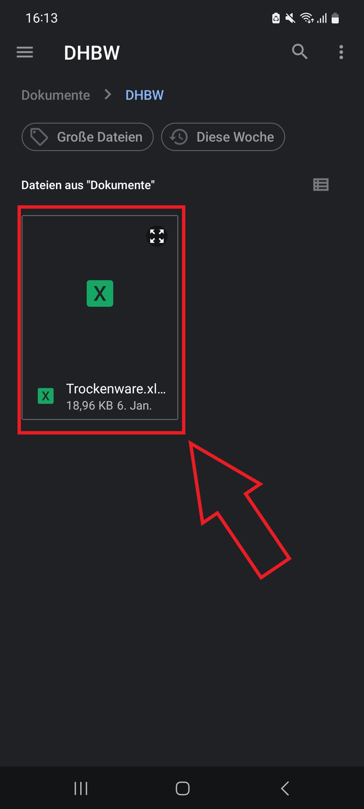
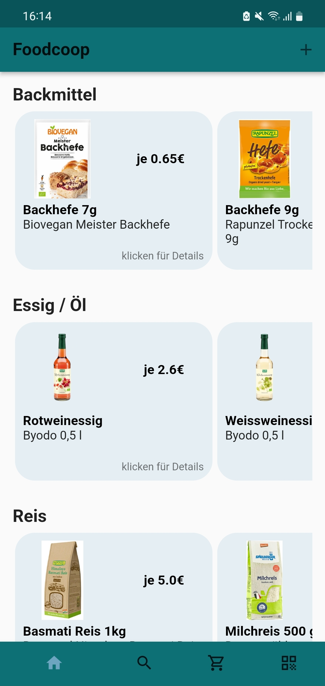
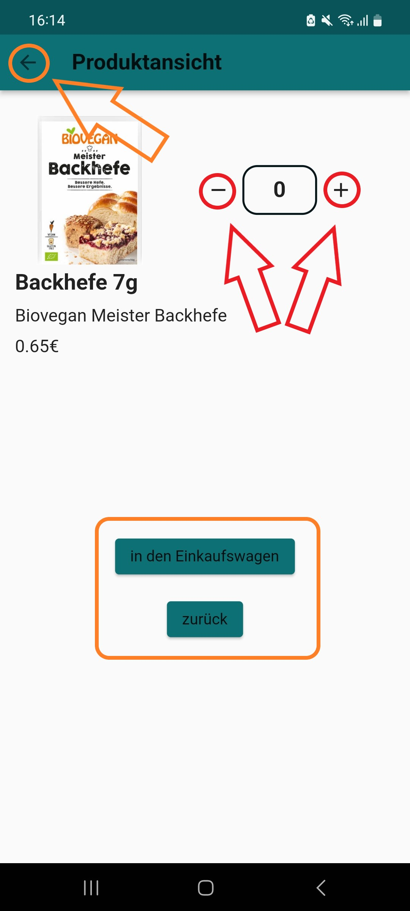
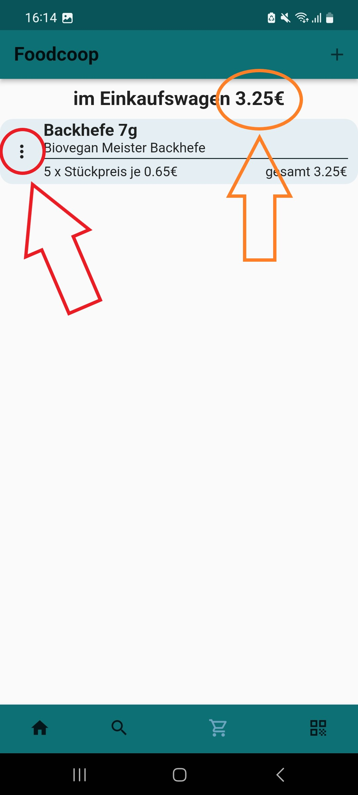
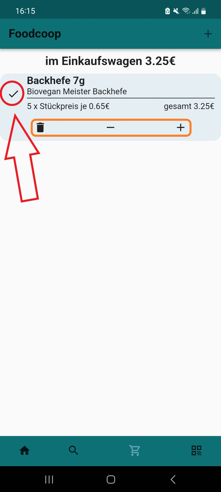
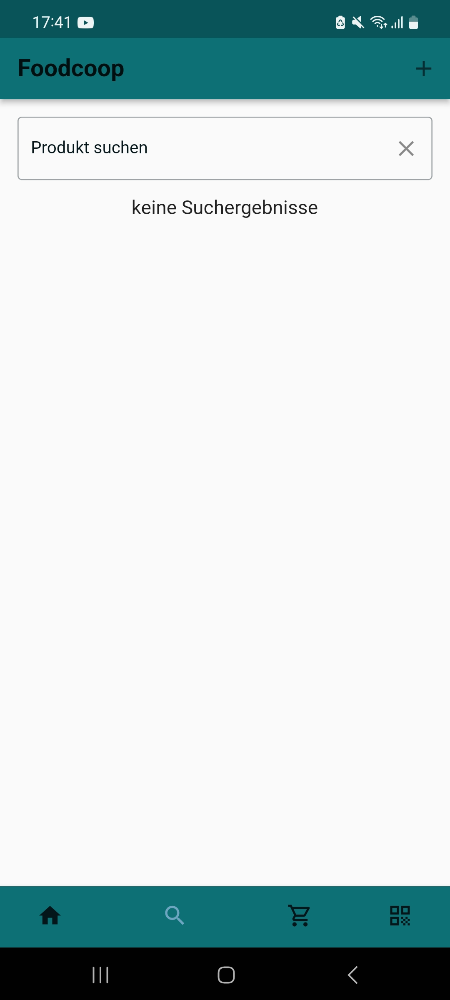
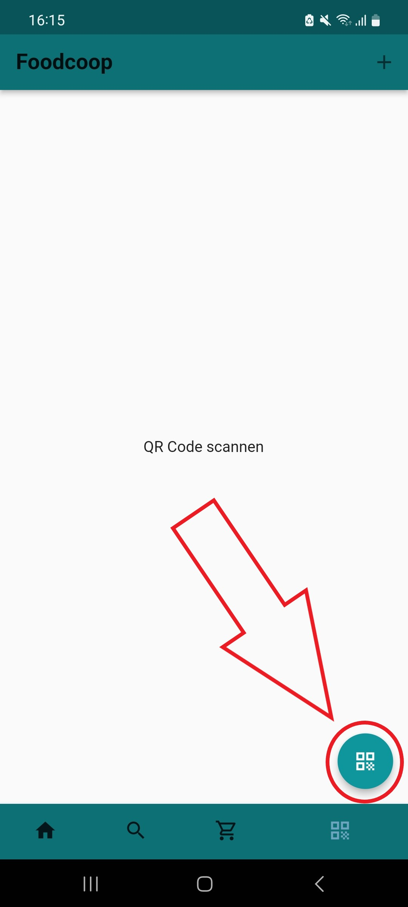

# Anleitung der Foodcoop App

Diese Anleitung enthält eine Beschreibung der Foodcoop App und der bereitgestellten Funktionen.

## Datenimport und Navigation

In rot markiert ist der Button für das Importieren der Excel Tabelle.

In orange markiert sind die verfügbaren Seiten der App (von links nach rechts). Farblich hervorgehoben ist die aktive Seite.
* Startseite
* Produktsuche
* Einkaufswagen
* QR-Code scannen

## Dateiauswahl für Datenimport

Nachdem der "+" Button für den Datenimport gedrückt wurde öffnet sich das Dateisystem des Gerätes. Hier kann die Excel Datei ausgewählt werden (klick auf die Datei).

## Hauptseite mit imporierten Daten

Nachdem die Daten importiert sind, werden die Kategorien in einer vertikalen Liste angezeigt.

Die Produkte in den Kategorien sind in einer honizontalen Liste eingeordnet.

Die Navigation erfolgt mit wischen nach oben, unten, rechts und links.

Ein Produkt kann mit einem Klick auf den farblich hinterlegten Bereich des Produktes in der Detailsansicht geöffnet werden.

## Detailansicht eines Produktes

Die Detailsansicht eines Produktes ist eine neue Seite in der App. Zu der Hauptseite kann zurückgekehrt werden indem der Button "zurück" oder der Pfeil oben links gedrückt wird.

Die gewünschte Menge des Produktes kann über den "-" und "+" Button eingestellt werden. Bei einer Menge über 0 kann der Button "in den Einkaufswagen" betätigt werden. Anschließend schließt sich die Seite der Detailsansicht und die Hauptseite wird wieder angezeigt.

## Der Einkaufswagen

Der Einkaufswagen zeigt den Gesamtpreis aller Produkte an (orange dargestellt).

Mit einem Klick auf die drei Punkte (rot dargestellt) kann der Eintrag bearbeitet werden.

## Einkaufswagen bearbeiten

Der Eintrag in dem Einkaufswagen kann mit den Buttons "-" und "+" bearbeitet werden. Dabei wird die Produktmenge dekrementiert oder inkrementiert. Der Button mit dem "Mülleimer" löscht das Produkt aus dem Einkaufswagen.

Nach der Bearbeitung kann der "Hacken" (rot dargestellt) geklickt werden und das Feld für die Bearbeitung wird ausgeblendet.

## Produktsuche

Die Produktsuche erfolgt über die Eingabe in der Suchleiste. Groß- und Kleinschreibung wird nicht berücksichtigt. Passende Produkte werden in einer vertikalen Liste unter der Suchleiste angezeigt. 

## QR-Code scannen

Mit dem Button unten rechts (rot dargestellt) wird die Kamera geöffnet und ein QR-Code kann gescannt werden. Anschließend öffnet sich die Kategorie des QR-Codes in einer vertikalen Liste.

