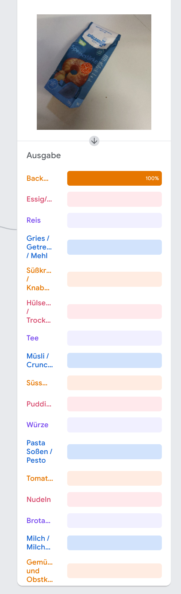

# Studienarbeit - Foodcoop

Die Foodcoop App ist ein digitaler Assistent für das Einkaufen von Trockenwaren.

Eine Anleitung der App ist in der Anleitung.md zu finden.


## Version 1.0.0

Die App befindet sich in Version 1.0.0.

Die Versionen der genutzten Plugins sind in der pubspec.yaml Datei aufgeführt. Diese Datei verwaltet alle Daten der App.


## Installation der App

In der Datei Installationsanleitung.md sind die Installattionsmöglichkeiten der App aufgeführt.


## Code

Alle Dateien mit Ausnahme des Ordners ```files``` sind für die App relevant. Der Programmcode der App liegt in dem Ordner ```lib```. Der Code ist in mehrere Packages aufgeteilt, welche nach Funktionsen unterteilt sind.


## Assets

In dem Ordner ```assets``` befinden sich alle benötigten Bilder der Produkte und das Modell für die Bilderkennung.


## Sonstige Dateien

In dem Ordner ```files``` befinden sich alle restlichen Daten und Dateien. Hier zu finden sind:

* APK-Datei der App
* Alle Bilder für das Modell der Bilderkennung
* Alle QR-Codes der Kategorien
* QR-Code Datei als Word und PDF zum ausdrucken
* Die Exceltabelle mit dem aktuellsten Datenbestand


## Test des Modells der bildkategorisierung

Das Modell der Bildkategorisierung ist direkt nach dem Training getestet. Dabei wurde das Produktbild von Speisestärke getestet, welches unter der Kategorie Backmittel eingeordnet ist.

Das Ergebnis des Modells ist die Kategorie Backmittel.

Hinweis: Das Modell ist mit 5000 Epochen trainiert. (Batchgröße 16, Lernrate 0,001)

> Die Bildkategorisierung ist in der App enthalten, jedoch funktioniert diese noch nicht vollständig. Eine umfängliche Analyse ist notwendig.


